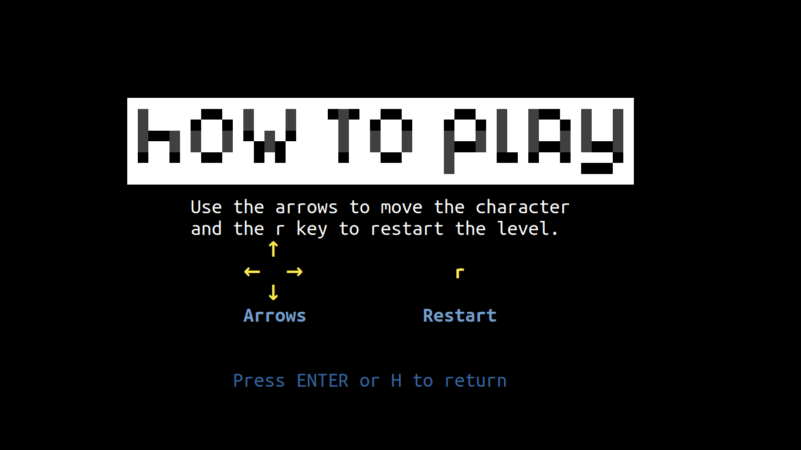
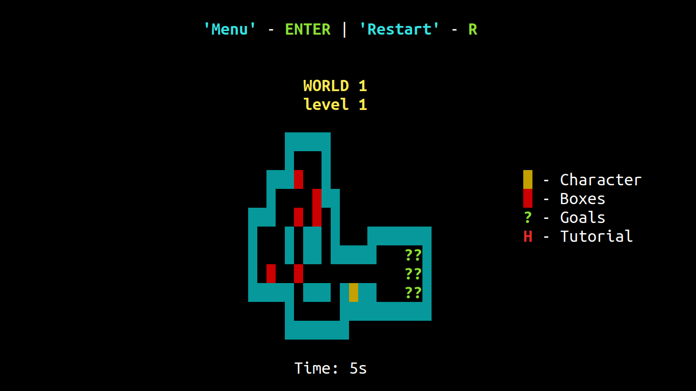
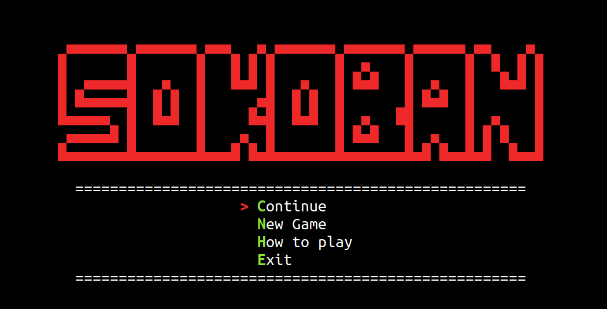

# Sokoban CLI

Segundo o Wikipedia, Sokoban (倉庫 番, Sōko-ban ) é um gênero de videogame de quebra - cabeça no qual o jogador empurra engradados ou caixas em um depósito , tentando levá-los para locais de armazenamento.
Sokoban foi criado em 1981 por Hiroyuki Imabayashi. O primeiro jogo comercial foi publicado em dezembro de 1982 pela Thinking Rabbit , uma software house com sede em Takarazuka , Japão.

## :dart: Objetivo

Avaliação da disciplina de Linguagem de Programação I (LP1).

## :tv: Screenshot

<p align="center" display="flex">
  
  
  
  
  
  
</p>

## :video_game: Demo

<p align="center" display="flex">
  
</p>

## &#x1F477;&#x1F3FF;&#x200D;&#x2642;&#xFE0F; Start

#### Ferramentas
* :pushpin: **
* :pushpin: **
* :pushpin: **

#### Repositório

```sh 
git clone https://github.com/dannRocha/sokoban-cli.git
```

#### :cd: Inicialização
No diretório do repositório, abra o terminal e rode o comando:
```sh
make
```
#### :warning: Observação
O jogo é uma aplicação de linha de comando, então é necessário inicializar a aplicação com um emulador de console (terminal)

## Referência

- WIKIPEDIA, ***Sokoban***. Disponível em: <<https://en.wikipedia.org/wiki/Sokoban>>. Acesso em 29 novembro de 2020.
- SOKOBAN, ***Sokoban - Original e Extra***. Disponível em: <<https://sokoban.info/>>. Acesso em 30 novembro de 2020.
