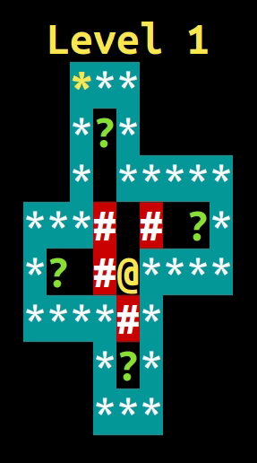

# Sokoban CLI
Segundo o Wikipedia, Sokoban (倉庫 番, Sōko-ban ) é um gênero de videogame de quebra - cabeça no qual o jogador empurra engradados ou caixas em um depósito , tentando levá-los para locais de armazenamento.
Sokoban foi criado em 1981 por Hiroyuki Imabayashi. O primeiro jogo comercial foi publicado em dezembro de 1982 pela Thinking Rabbit , uma software house com sede em Takarazuka , Japão.

## :dart: Objetivo

Atividade da disciplina de linguagem de programação I.

## :tv: Demo

  

## &#x1F477;&#x1F3FF;&#x200D;&#x2642;&#xFE0F; Start

## Referência

- WIKIPEDIA, *Sokoban*, Disponivel em: <<https://en.wikipedia.org/wiki/Sokoban>>. Acesso em 29 novembro de 2020.
